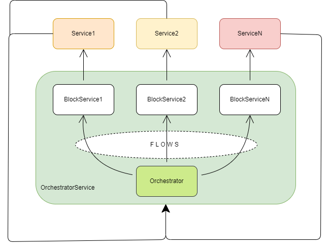

# orch_serv

> A library for quickly creating services and orchestration services between many services in a microservice architecture


### Installation

```bash
pip install orch_serv
```

### Problem

We have a microservice architecture

Your architecture has many services. Each individual service performs its own task. You need to set up the sequence of interaction between services, taking into account that one service can be connected to others and fired in a different sequence.

<u>Example:</u>

Task | Service execution sequence 
--- | --- 
*Task1* | service1 -> service2 -> service3
*Task2* | service2 -> service4 -> service1
*...* | ...
*TaskN* | service3 -> service2 -> ... -> serviceM

For centralized management of the interaction of services, we offer you an orchestrator - the service contains valid block connections.



What you need in the orchestrator service
- create blocks that know how to interact with the services they belong to
- create accessible flows from these blocks (for different tasks there can be your own flow - the main thing is to contain unique flow names)
- define a message for the interaction of services so that they have a single standard and override key methods
- initialize the orchestrator and use
- [detailed](./orch_serv/orchestrator/README.md)

What you need to use the service:
- define a message for the interaction of services so that they have a single standard and override key methods
- define the commands in the service which it will execute and what to do after the main task is completed (divided to separate the logic)
- [detailed](./orch_serv/service/README.md)
